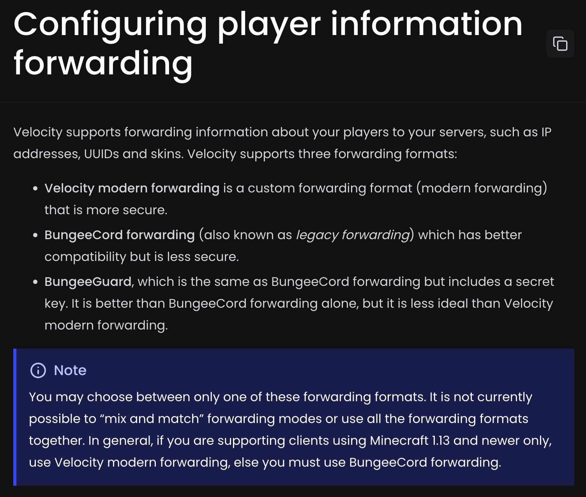

## Envoy



A Velocity plugin that brings you per-server information forwarding

Hoping one day this plugin becomes [obsolete](https://github.com/PaperMC/Velocity/pull/1655)...

Version: 0.1.0

Tested Velocity versions: 4.0.X, 4.1.X

### How to use

1. Install Velocity
2. Set `player-info-forwarding-mode` to **none** in `velocity.toml` (otherwise Envoy will not work)
3. Install Envoy jar to `plugins` folder where Velocity lives
4. Start Velocity to generate the config file
5. Open `config.yml` in the `plugins/envoy` folder and set the `name` and `forwarding-mode` to the desired mode for each of your servers
6. Restart Velocity

#### Example config
```yaml
servers:
  - name: "vanilla26_2"
    forwarding-mode: "modern"
  - name: "gtnh"
    forwarding-mode: "bungeeguard"
```

### Build

```shell
./gradlew build
```